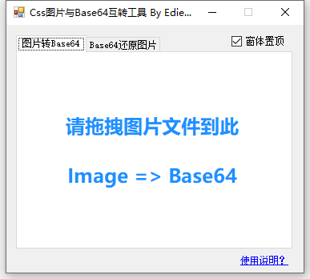

# CSS图片与Base64互转工具

> 2012年的时候做的这个，在使用上基本不会出现Bug！代码写得可能比较渣，请不要介意！

## 软件界面

## 使用介绍
1. 暂支持.png|.jpg|.gif|.bmp格式。**文件大小限制为小于或等于100KB**

2. Base64数据保存到对应的图片路径中。**【原图片名称-Base64.txt】**
   还原的图片保存在对应的CSS同级目录下的 **【CssBase64ToImg】** 文件夹里
   
3. 命令行使用方法（请使用绝对路径）：

   CssImgBase64 E:\\1.png 或 CssImgBase64 "E:\\1.png"   
   CssImgBase64 E:\\1.css 或 CssImgBase64 "E:\\1.css"

> **[注意]** 命令行只支持单个文件，路径建议使用双引号(空格、特殊字符...)

> **[提示]** 可开发插件调用此工具，也可为css或图片文件设置右键菜单执行
